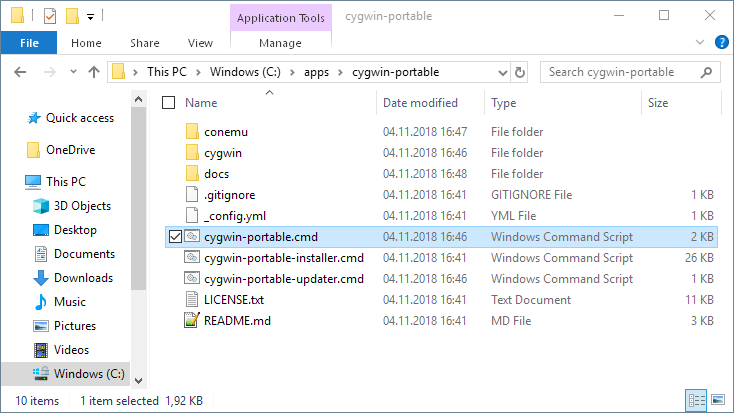

# cygwin-portable-installer <a href="https://github.com/vegardit/cygwin-portable-installer" title="GitHub Repo"></a> <a href="https://ansible.com" title="Ansible"></a> <a href="https://mintty.github.io/" title="MinTTY"></a><a href="https://conemu.github.io/" title="ConEmu"></a> <a href="https://www.cygwin.com/" title="CygWin"></a>

[](#license)
[](CODE_OF_CONDUCT.md)

1. [What is it?](#what-is-it)
1. [Features](#features)
1. [Installation](#install)
   1. [Customizing the installer](#customize)
1. [Update](#update)
1. [License](#license)


## <a name="what-is-it"></a>What is it?

cygwin-portable-installer is a self-containing Windows batch file to perform an unattended installation of a portable [Cygwin](http://cygwin.org) environment.

The installer has been implemented as a Batch script and not PowerShell script because in some corporate environments execution of PowerShell scripts is
disabled for non-administrative users via group policies.


## Features

* **portable**: you can e.g. install it on an USB sticks and use the same configuration on different computers
* **256-color multi-tabbed shell**: [ConEmu](https://conemu.github.io/) is pre-configured as terminal by default. Alternatively you can choose to use the single tabbed [Mintty](https://mintty.github.io/) terminal.
* **command-line package installer**: [apt-cyg](https://github.com/kou1okada/apt-cyg) package manager will be automatically installed (opt-out via config parameter is possible)
* **adaptive Bash prompt**: [bash-funk](https://github.com/vegardit/bash-funk) will be automatically installed (opt-out via config parameter is possible)
* additional tools (opt-out via config parameter is possible):
    * [Ansible](https://github.com/ansible/ansible): deployment automation tool
    * [AWS CLI](https://github.com/aws/aws-cli): AWS cloud commandline tool
    * [Node.js](https://nodejs.org): JavaScript runtime
    * [testssl.sh](https://testssl.sh/): command line tool to check SSL/TLS configurations of servers


## <a name="install"></a>Installation

1. Get a copy of the installer using one of these ways:
   * Using old-school **Copy & Paste**:
      1. Create a local empty directory where Cygwin shall be installed, e.g. `C:\apps\cygwin-portable`
      1. Download the [cygwin-portable-installer.cmd](cygwin-portable-installer.cmd) file into that directory.
   * Using **Git**:
      1. Clone the project into a local directory, e.g.
         ```batch
         git clone https://github.com/vegardit/cygwin-portable-installer --single-branch --branch master --depth 1 C:\apps\cygwin-portable
         ```
1. (Optional) Open the file [cygwin-portable-installer.cmd](cygwin-portable-installer.cmd) in a text editor and adjust the configuration variables to e.g. set an HTTP Proxy, change the set of pre-installed Cygwin packages, select the terminal (ConEmu or Mintty), etc.
1. (Optional) Temporarily disable your Antivirus scanner in case it is known to interfer with Cygwin, otherwise you may end-up with a broken/incomplete installation. See [cygwin.com/faq: What applications have been found to interfere with Cygwin?](https://cygwin.com/faq/faq.html#faq.using.bloda)
   * For **BitDefender Antivirus** the **Advanced Thread Defense** protection feature needs to be disabled and not the **Antivirus > Settings > BitDefender Shield**.
1. Execute the `cygwin-portable-installer.cmd`. This will automatically:
    1. download the 32-bit or 64-bit Cygwin setup.exe depending on your OS
    1. install [Cygwin](http://cygwin.org) with the pre-selected set of packages
    1. install the [ConEmu](https://conemu.github.io/) tabbed terminal
    1. create an init scripts that will keep the installation portable
    1. install the [apt-cyg](https://github.com/kou1okada/apt-cyg) command-line package manager
    1. install the [bash-funk](https://github.com/vegardit/bash-funk) Bash toolbox with it's adaptive Bash prompt
    1. install [Ansible](https://github.com/ansible/ansible)
    1. install [AWS CLI](https://github.com/aws/aws-cli)
    1. install [Node.js](https://nodejs.org)
    1. install [testssl.sh](https://testssl.sh/)
1. Now you can launch your portable Cygwin environment using the newly created `cygwin-portable.cmd` batch file.
    


### <a name="customize"></a>Customizing the installer

You can customize the installer by either directly modifying the default settings in the `cygwin-portable-installer.cmd` file,
or by placing a separate file called `cygwin-portable-installer-config.cmd` next to it where some or all of these settings are overwritten.

These settings are currently available:

```batch
:: set proxy if required (unfortunately Cygwin setup.exe does not have commandline options to specify proxy user credentials)
set PROXY_HOST=
set PROXY_PORT=8080

:: change the URL to the closest mirror https://cygwin.com/mirrors.html
set CYGWIN_MIRROR=http://linux.rz.ruhr-uni-bochum.de/download/cygwin

:: one of: auto,64,32 - specifies if 32 or 64 bit version should be installed or automatically detected based on current OS architecture
set CYGWIN_ARCH=auto

:: choose a user name under Cygwin
set CYGWIN_USERNAME=root

:: select the packages to be installed automatically via apt-cyg
set CYGWIN_PACKAGES=bash-completion,bc,curl,expect,git,git-svn,gnupg,inetutils,lz4,mc,nc,openssh,openssl,perl,psmisc,python37,pv,rsync,ssh-pageant,screen,subversion,unzip,vim,wget,zip,zstd

:: if set to 'yes' the local package cache created by cygwin setup will be deleted after installation/update
set DELETE_CYGWIN_PACKAGE_CACHE=no

:: if set to 'yes' the apt-cyg command line package manager (https://github.com/kou1okada/apt-cyg) will be installed automatically
set INSTALL_APT_CYG=yes

:: if set to 'yes' the bash-funk adaptive Bash prompt (https://github.com/vegardit/bash-funk) will be installed automatically
set INSTALL_BASH_FUNK=yes

:: if set to 'yes' Node.js (https://nodejs.org/) will be installed automatically
set INSTALL_NODEJS=yes
:: Use of the folder names found here https://nodejs.org/dist/ as version name.
set NODEJS_VERSION=latest-v12.x
:: one of: auto,64,32 - specifies if 32 or 64 bit version should be installed or automatically detected based on current OS architecture
set NODEJS_ARCH=auto

:: if set to 'yes' Ansible (https://github.com/ansible/ansible) will be installed automatically
set INSTALL_ANSIBLE=yes
set ANSIBLE_GIT_BRANCH=stable-2.9

:: if set to 'yes' AWS CLI (https://github.com/aws/aws-cli) will be installed automatically
set INSTALL_AWS_CLI=yes

:: if set to 'yes' testssl.sh (https://testssl.sh/) will be installed automatically
set INSTALL_TESTSSL_SH=yes
:: name of the GIT branch to install from, see https://github.com/drwetter/testssl.sh/
set TESTSSL_GIT_BRANCH=v2.9.5-8

:: use ConEmu based tabbed terminal instead of Mintty based single window terminal, see https://conemu.github.io/
set INSTALL_CONEMU=yes
set CON_EMU_OPTIONS=-Title cygwin-portable ^
 -QuitOnClose

:: add more path if required, but at the cost of runtime performance (e.g. slower forks)
set CYGWIN_PATH=%%SystemRoot%%\system32;%%SystemRoot%%

:: set Mintty options, see https://cdn.rawgit.com/mintty/mintty/master/docs/mintty.1.html#CONFIGURATION
set MINTTY_OPTIONS=--Title cygwin-portable ^
  -o Columns=160 ^
  -o Rows=50 ^
  -o BellType=0 ^
  -o ClicksPlaceCursor=yes ^
  -o CursorBlinks=yes ^
  -o CursorColour=96,96,255 ^
  -o CursorType=Block ^
  -o CopyOnSelect=yes ^
  -o RightClickAction=Paste ^
  -o Font="Courier New" ^
  -o FontHeight=10 ^
  -o FontSmoothing=None ^
  -o ScrollbackLines=10000 ^
  -o Transparency=off ^
  -o Term=xterm-256color ^
  -o Charset=UTF-8 ^
  -o Locale=C
```

### <a name="customize"></a>Executing commands after installation

When you place a separate `cygwin-portable-installer-post-tasks.cmd` file next to the `cygwin-portable-installer.cmd` it will be
executed automatically after the installation suceeded. You can use this file to perform additional configurations.


## <a name="update"></a>Updating your installation

To update installed Cygwin packages execute the generated `cygwin-portable-updater.cmd` file.


## <a name="license"></a>License

All files are released under the [Apache License 2.0](LICENSE.txt).

Individual files contain the following tag instead of the full license text:
```
SPDX-License-Identifier: Apache-2.0
```

This enables machine processing of license information based on the SPDX License Identifiers that are available here: https://spdx.org/licenses/.
